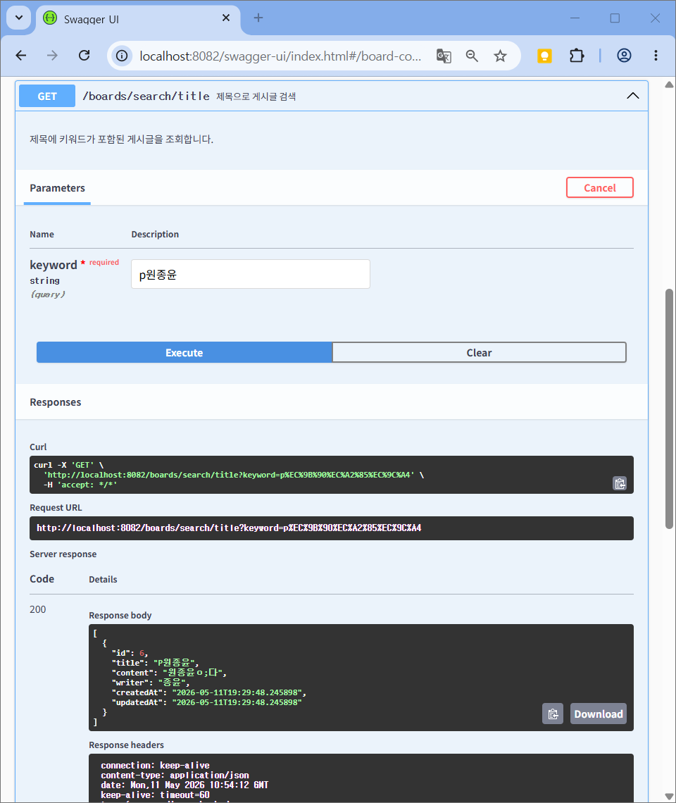
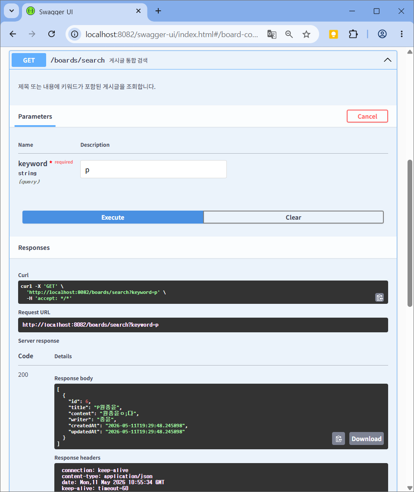
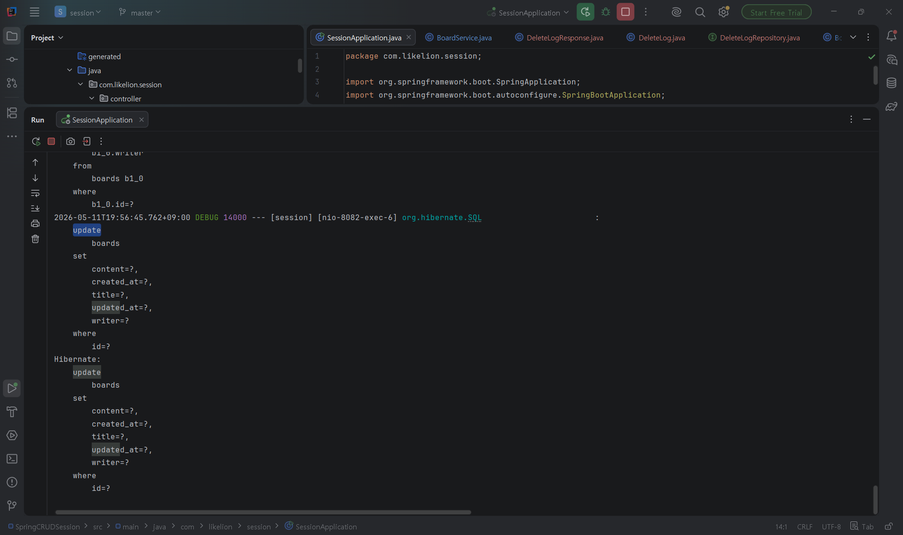
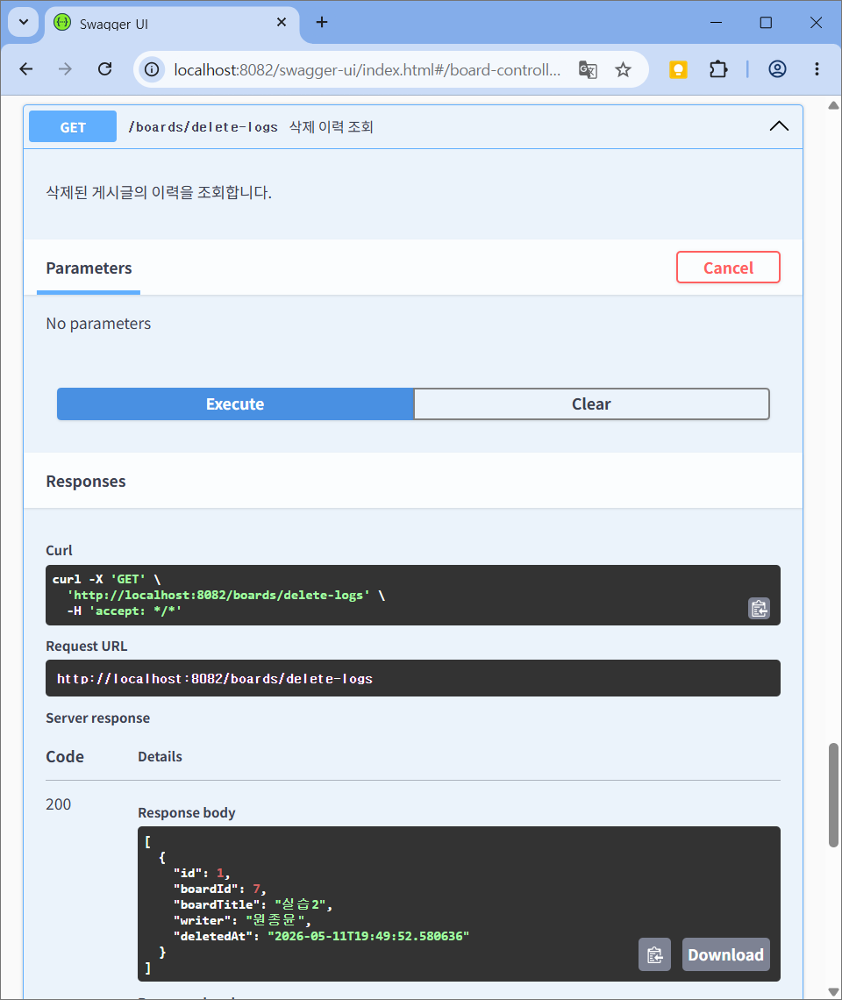
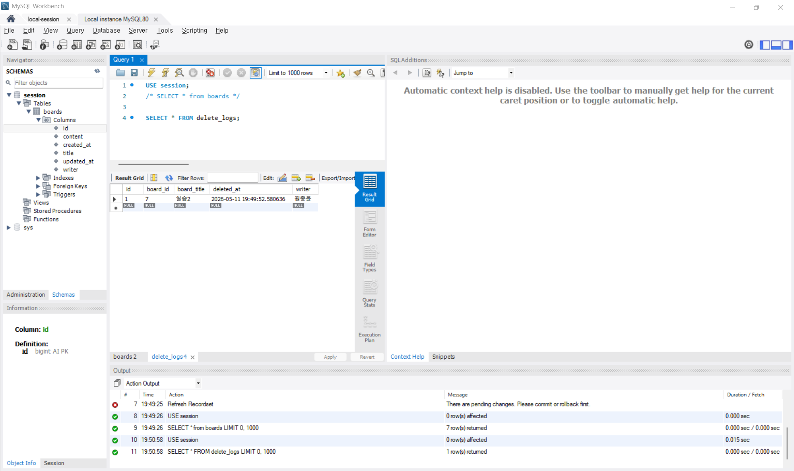

# 6️⃣ Spring Data JPA & 서비스 아키텍처 — 학습 정리 & 과제

> 멋쟁이사자처럼 6주차 세션 정리 문서


> 주제: Spring Data JPA가 실제로 어떻게 동작하는지, 그리고 계층형 서비스 아키텍처

---

## 📌 목차

1. [오늘 배운 개념 정리 (본인 말로)](#1-오늘-배운-개념-정리-본인-말로)
   - [1-1. ORM과 Spring Data JPA](#1-1-orm과-spring-data-jpa)
   - [1-2. 영속성 컨텍스트와 Dirty Checking](#1-2-영속성-컨텍스트와-dirty-checking)
   - [1-3. JpaRepository 뜯어보기](#1-3-jparepository-뜯어보기)
   - [1-4. 쿼리 메서드 & @Query](#1-4-쿼리-메서드--query)
   - [1-5. 계층형 아키텍처와 @Transactional](#1-5-계층형-아키텍처와-transactional)
   - [1-6. [번외] Drizzle ORM — JPA 말고 다른 ORM이 궁금해서 찾아봄](#1-6-번외-drizzle-orm--jpa-말고-다른-orm이-궁금해서-찾아봄)
2. [실습 결과](#2-실습-결과-필수-요건-캡쳐)
3. [회고](#3-회고)

---

## 1. 오늘 배운 개념 정리

### 1-1. ORM과 Spring Data JPA

**ORM(Object-Relational Mapping)** 은 자바 객체와 DB 테이블을 자동으로 연결해 주는 기술이다.
예전 JDBC 방식에서는 `INSERT INTO boards (title, content) VALUES (?, ?)` 같은 SQL을 직접 손으로 짜야 했지만,
JPA를 쓰면 `boardRepository.save(board)` 한 줄이면 JPA가 알아서 SQL을 생성해 실행해 준다.
**SQL을 직접 안 써도 되니까 생산성이 크게 올라간다**는 게 핵심이라고 이해했다.

용어가 헷갈렸는데 정리하면 이렇다.

| 용어 | 한 줄 정의 | 비유 |
| --- | --- | --- |
| **JPA** | 자바 표준 ORM **명세(인터페이스 모음)** | "이렇게 동작해야 한다"는 규격서 |
| **Hibernate** | JPA 명세의 **실제 구현체** | 규격서대로 만든 진짜 제품 |
| **Spring Data JPA** | JPA를 더 쉽게 쓰도록 Spring이 한 번 더 감싼 것 | 제품을 더 편하게 쓰는 리모컨 |

→ 우리가 `JpaRepository`만 상속받아도 `save()`, `findAll()`, `findById()`가 공짜로 생기는 이유가 바로 **Spring Data JPA** 덕분이다.

### 1-2. 영속성 컨텍스트와 Dirty Checking

가장 인상 깊었던 부분. **영속성 컨텍스트(Persistence Context)** 는 JPA가 엔티티 객체를 관리하는 메모리 공간(1차 캐시)이다.

`@Transactional` 안에서 일어나는 일을 순서대로 보면:

```text
1. findById(id) 호출
   → DB에서 Board 조회
   → 영속성 컨텍스트에 저장 (이때 "스냅샷"도 같이 떠 둔다)

2. board.update(title, content) 호출
   → 영속성 컨텍스트 안의 Board 객체 값만 바뀐다

3. 트랜잭션 종료(commit)
   → 처음 떠 둔 스냅샷 vs 현재 객체 상태를 비교
   → 달라진 컬럼 발견 → UPDATE SQL 자동 실행!
```

이게 바로 **Dirty Checking(변경 감지)** 이다.
실제 우리 `BoardService.update()` 코드를 보면 값만 바꾸고 **`save()`를 호출하지 않는다.**

```java
// src/main/java/com/likelion/session/service/BoardService.java
public BoardResponse update(Long id, BoardUpdateRequest request) {
    Board board = boardRepository.findById(id)
            .orElseThrow(() -> new IllegalArgumentException("해당 게시글이 없습니다. id=" + id));

    board.update(request.getTitle(), request.getContent()); // 값만 변경
    // boardRepository.save(board) ← 없음! 그래도 UPDATE 됨

    return BoardResponse.builder() /* ... */ .build();
}
```

`save()`를 안 했는데도 UPDATE 쿼리가 나가는 걸 콘솔에서 직접 확인했다 → [실습 2 캡쳐](#-실습-2--dirty-checking-savesave-호출-없이-update-반영)

> 참고: `@Transactional(readOnly = true)` 를 조회 메서드에 붙이면 JPA가 Dirty Checking을 **비활성화**해서 스냅샷을 안 떠 두므로 성능이 좋아진다. 그래서 조회 전용 메서드(`findAll`, `searchByTitle` 등)에는 전부 `readOnly = true`를 붙였다.

### 1-3. JpaRepository 뜯어보기

`extends JpaRepository<Board, Long>` 한 줄이면 아래 메서드를 그냥 쓸 수 있다.

| 메서드 | 설명 |
| --- | --- |
| `save(entity)` | 저장 또는 수정 (id 없으면 INSERT, 있으면 UPDATE) |
| `findById(id)` | id로 단건 조회 → `Optional<T>` 반환 |
| `findAll()` | 전체 조회 |
| `delete(entity)` / `deleteById(id)` | 삭제 |
| `count()` | 전체 개수 |
| `existsById(id)` | 존재 여부 확인 |

`findById`가 `Optional`을 반환하기 때문에 우리 코드에서 `.orElseThrow(...)`로 "없으면 예외" 처리를 깔끔하게 할 수 있었다.

### 1-4. 쿼리 메서드 & @Query

**쿼리 메서드**: 메서드 **이름**만 규칙대로 지으면 Spring Data JPA가 SQL을 자동 생성한다. 규칙은 `find + By + 필드명 + 조건`.

이번 실습에서 `BoardRepository`에 직접 추가한 코드:

```java
// src/main/java/com/likelion/session/repository/BoardRepository.java
public interface BoardRepository extends JpaRepository<Board, Long> {

    // 제목에 keyword가 "포함"된 글 → LIKE '%keyword%'
    List<Board> findByTitleContaining(String keyword);

    // 작성자가 "정확히 일치"하는 글 → WHERE writer = ?
    List<Board> findByWriter(String writer);

    // 너무 복잡해서 직접 JPQL 작성 (@Query)
    @Query("SELECT b FROM Board b WHERE b.title LIKE %:keyword% OR b.content LIKE %:keyword% ORDER BY b.createdAt DESC")
    List<Board> searchByKeyword(@Param("keyword") String keyword);

    // 페이지네이션 적용 검색 (Pageable 파라미터 추가)
    Page<Board> findByTitleContaining(String keyword, Pageable pageable);
}
```

알게 된 키워드 정리:

| 키워드 | 의미 | 예시 |
| --- | --- | --- |
| `Containing` | `LIKE '%값%'` | `findByTitleContaining` |
| `StartingWith` / `EndingWith` | `LIKE '값%'` / `LIKE '%값'` | `findByTitleStartingWith` |
| `OrderBy...Desc` | 정렬 | `findByWriterOrderByCreatedAtDesc` |
| `And` / `Or` | 조건 결합 | `findByTitleAndWriter` |

**`@Query`** 는 쿼리 메서드 이름으로 표현하기 너무 복잡할 때 직접 JPQL을 쓰는 방법.
JPQL은 SQL과 비슷하지만 **테이블명이 아니라 엔티티 클래스명(`Board`)** 을 쓴다는 게 포인트.

### 1-5. 계층형 아키텍처와 @Transactional

**Controller → Service → Repository** 로 역할을 쪼개는 이유를 코드로 체감했다.

| 계층 | 역할 |
| --- | --- |
| **Controller** | HTTP 요청/응답만 담당. 비즈니스 로직 X. Service에 위임만. |
| **Service** | 실제 비즈니스 로직. `@Transactional` 관리. **여러 Repository 조합 가능.** |
| **Repository** | DB 접근/쿼리 실행만. |

이번 실습에서 `delete()`가 좋은 예시였다. 게시글을 지우기 전에 **삭제 이력을 남기려고 Service에서 Repository 두 개를 조합**했다.

```java
// src/main/java/com/likelion/session/service/BoardService.java
public void delete(Long id) {
    Board board = boardRepository.findById(id)
            .orElseThrow(() -> new IllegalArgumentException("해당 게시글이 없습니다. id=" + id));

    // 삭제 이력 저장 (Repository 2개를 한 트랜잭션에서 조합!)
    DeleteLog log = new DeleteLog(board.getId(), board.getTitle(), board.getWriter());
    deleteLogRepository.save(log);

    boardRepository.delete(board); // 게시글 삭제
}
```

Controller는 이 안에서 Repository를 몇 개 쓰는지 **전혀 몰라도 된다.** 이게 계층 분리의 힘.

**@Transactional** 핵심 정리:

- 한 메서드 안의 여러 DB 작업을 "전부 성공 or 전부 롤백"으로 묶어 **데이터 일관성**을 보장한다.
  (게시글 저장은 성공했는데 알림 저장이 실패하면 → 전체 롤백되어 게시글도 저장 안 됨)
- `readOnly = true` 는 조회 전용 트랜잭션임을 알려 Dirty Checking을 끄고 성능을 높인다. 조회 메서드엔 항상 붙이는 게 권장.

### 1-6. [번외] Drizzle ORM — JPA 말고 다른 ORM이 궁금해서 찾아봄

> 보조강사를 하면서 다른 분들 코드를 보다가 ORM 이야기가 나왔는데, "ORM = Java의 JPA"라고만 생각하고 있던 게 좀 걸렸다. ORM은 특정 언어의 것이 아니라 **개념**이라, 다른 생태계에선 어떻게 생겼는지 궁금해서 TypeScript 진영에서 요즘 많이 쓴다는 **Drizzle ORM**을 찾아봤다.

**Drizzle ORM이 뭔가?**

- **TypeScript 전용 ORM**. Node.js / 서버리스(Edge) 환경에서 SQL DB(PostgreSQL · MySQL · SQLite 등)를 다룰 때 쓴다.
- 핵심 철학은 **"If you know SQL, you know Drizzle"** — 쿼리 빌더가 SQL 문법에 거의 1:1로 대응돼서, JPQL처럼 추상화된 별도 쿼리 언어를 새로 배울 필요가 거의 없다.
- **코드 우선(code-first)**: 스키마를 별도 파일/언어가 아니라 **TypeScript 코드로 직접 정의**한다. 스키마를 고치면 타입이 즉시 따라 바뀌고, 별도 코드 생성(generate) 단계가 없다.
- **가볍다**: 쿼리 엔진 같은 무거운 레이어 없이 SQL 문자열을 바로 생성 → ORM 오버헤드가 작고 번들 크기도 작다. 그래서 Edge/서버리스 런타임(Neon, Cloudflare D1, PlanetScale, Turso 등)에서 잘 돌아간다.

**JPA(우리가 배운 것)와 비교해서 이해해 본 것:**

| 관점 | Spring Data JPA (Java) | Drizzle ORM (TypeScript) |
| --- | --- | --- |
| 추상화 수준 | 높음 — 영속성 컨텍스트·Dirty Checking 등 ORM이 많이 대신해 줌 | 낮음 — SQL에 가깝게, 개발자가 쿼리를 거의 그대로 통제 |
| 스키마 정의 | `@Entity` 붙인 자바 클래스 | TypeScript 코드로 테이블 정의 |
| 쿼리 방식 | 쿼리 메서드 / JPQL(`@Query`) | SQL 같은 쿼리 빌더 + 관계형 쿼리 API |
| 변경 감지 | **Dirty Checking 있음** (`save()` 없이 UPDATE) | 그런 자동 감지 개념 없음 — `update()`를 명시적으로 호출 |
| 마이그레이션 | Hibernate `ddl-auto` 등 | Drizzle Kit |

> 같은 TypeScript 진영의 **Prisma**는 반대로 자체 스키마 언어(PSL)를 쓰고 추상화가 더 높은 편이라, 오히려 **JPA의 감성에 더 가깝다**고 느꼈다. 2026년 기준 분위기는 "서버리스/Edge 위주면 Drizzle, 복잡한 관계형·모놀리식이면 Prisma"로 갈리는 듯.
>
> **결론적으로 배운 점**: Dirty Checking처럼 "ORM이 알아서 해 주는 마법"은 JPA(영속성 컨텍스트)의 특징이지 모든 ORM의 공통 기능이 아니다. Drizzle은 일부러 그 마법을 빼고 SQL에 가깝게 가는 방향을 택했다. ORM이라는 같은 단어 안에도 **"얼마나 추상화할 것인가"** 라는 스펙트럼이 있다는 걸 알게 됐다.

> 출처:
> [Prisma 공식 문서 — Prisma ORM vs Drizzle](https://www.prisma.io/docs/orm/more/comparisons/prisma-and-drizzle) ·
> [Drizzle vs Prisma in 2026 (Encore)](https://encore.dev/articles/drizzle-vs-prisma) ·
> [Drizzle vs Prisma ORM in 2026 (MakerKit)](https://makerkit.dev/blog/tutorials/drizzle-vs-prisma)

---

## 2. 실습 결과

### ✅ 실습 1 — 검색 API 3종 정상 응답

#### ① `GET /boards/search/title` — 제목으로 검색

`keyword`가 **제목에 포함**된 게시글을 조회. (`findByTitleContaining`)
응답 `200`, `title`에 키워드가 포함된 게시글이 정상 반환됨.



#### ② `GET /boards/search/writer` — 작성자로 검색

`writer`가 **정확히 일치**하는 게시글을 조회. (`findByWriter`)
응답 `200`, `writer: "원종윤"` 게시글이 정상 반환됨.


#### ③ `GET /boards/search` — 제목+내용 통합 검색

`@Query`(JPQL)로 **제목 또는 내용**에 키워드가 포함된 글을 검색. (`searchByKeyword`)
응답 `200`, `keyword=p`로 검색 시 정상 반환됨.



### ✅ 실습 2 — Dirty Checking (`save()` 호출 없이 UPDATE 반영)

`PUT /boards/{id}` 호출 후 IntelliJ 콘솔.
`BoardService.update()`에 `boardRepository.save()`가 **없는데도** Hibernate가
`update boards set content=?, title=?, updated_at=?, writer=? where id=?` 쿼리를 자동으로 날렸다.
→ **변경 감지(Dirty Checking) 동작 확인 완료** ✅



### ✅ 실습 3 — 여러 Repository 조합: 삭제 이력 남기기

게시글을 `DELETE` 한 뒤 `GET /boards/delete-logs` 호출.
`boardId`, `boardTitle`, `writer`, `deletedAt` 필드가 모두 정상적으로 담겨 반환됨.
(Service에서 `boardRepository` + `deleteLogRepository`를 조합한 결과)



### ✅ 실습 4 — MySQL Workbench에서 직접 확인

`SELECT * FROM delete_logs;` 실행 결과.
DB의 `delete_logs` 테이블에도 삭제 이력이 실제로 INSERT 된 것을 확인.



---

## 3. 회고

- `save()`를 호출하지 않았는데 UPDATE 쿼리가 콘솔에 찍히는 걸 직접 보니 **영속성 컨텍스트 / Dirty Checking**이 머리에 확실히 박혔다. "스냅샷을 떠 두고 commit 시점에 비교한다"는 흐름이 핵심.
- 쿼리 메서드는 이름 규칙만 알면 SQL을 안 짜도 돼서 편하지만, 조금만 복잡해지면 `@Query`로 JPQL을 직접 쓰는 게 낫다는 걸 `searchByKeyword`에서 체감했다. JPQL은 **테이블이 아니라 엔티티명**을 쓴다는 점을 주의.
- `delete()`에서 Repository 2개를 한 Service 메서드 안에서 조합하면서, Controller가 내부 구현을 전혀 몰라도 되는 **계층 분리의 장점**을 실제로 느꼈다. 나중에 DB나 API 경로가 바뀌어도 해당 계층만 고치면 된다.
- 조회 메서드에 `@Transactional(readOnly = true)`를 빠짐없이 붙이는 습관을 들여야겠다고 생각했다.

---
